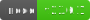

<p align="center">
  <h2 align="center">Unbound - Realtime Chat App</h2>
</p>

<div align="center">
    
    
    
</div>

Unbound - Realtime chat application. Built with Websocket, PostgreSQL, React.js and Knex.js


## Installation

- <p>Install project source code via: <code>git clone https://github.com/yasin2dev/unbound.git</code></p>

- <p>Open the command line within the downloaded folder, navigate to the server and client directories, and run the command <code>npm i</code>:</p>
```cmd
    C:\unbound> cd server
    C:\unbound\server> npm i
```
```cmd
    C:\unbound> cd client
    C:\unbound\client> npm i
```
- To complete the database configuration, you need to create and edit the <code>.env</code> file.

#### Database

For tables, you must install knex via ```npm i -g knex``` or run with ```npx knex```.

Run the command ``` knex migrate:latest ```

You are ready to go!

## Run Project
- For running the server:
```cmd
    C:\unbound> cd server
    C:\unbound\server> npm run start
```
- For running front-end:
```cmd
    C:\unbound> cd client
    C:\unbound\client> npm run dev
```

## Future Plans

With version 0.0.1b, there is no auth system actually. It is not a release version. It is a (W)ork (I)n (P)rogress version.

- Auth System (High Priority)
- SideBar for channels
- Voice communication (webRTC)